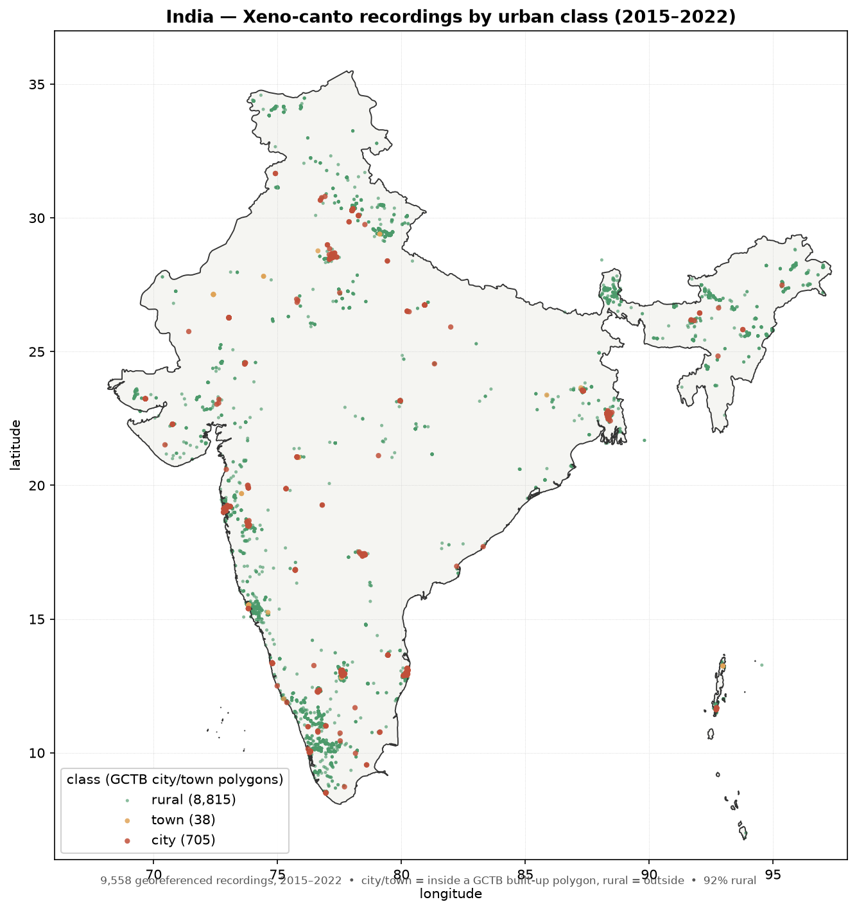

# Acoustic Biodiversity Mapping

A global, location-level biodiversity metric derived from ~760k Xeno-canto wildlife
recordings (2015–2025) and their metadata. See **[report/Acoustic_Biodiversity_Report.pdf](report/Acoustic_Biodiversity_Report.pdf)**
for the full write-up, world map, and results — or open the interactive
**[web/year_explorer.html](web/year_explorer.html)** to scrub/play through the map year by year (2015–2025).

## The metric

- **Location** = a 0.1° (~11 km) grid cell.
- **Biodiversity value** = `S_rare10` — the expected number of distinct recorded species
  in 10 recordings (Hurlbert sample-based rarefaction; controls for recording effort).
- **Label** = good / moderate / bad, by tertile of `S_rare10` *within the cell's 10° latitude
  band* (region-relative, so a score means "rich for its region").
- **Scope** = cells with ≥ 10 recordings (11,088 of 40,914 cells scored confidently).

## Headline finding

The 42 acoustic indices (ACI, ADI, NDSI, Bioacoustic Index, …) **do not predict species
richness** on this archive (best Spearman ρ ≈ 0.09). They were designed for passive
soundscape monitoring, but 69% of the archive is single-target recordings (median 24 s).
The defensible biodiversity metric is therefore **effort-controlled species richness from
the metadata**, not any acoustic index. Full limitations are in the report.

## Pipeline (scripts/)

| Script | Purpose |
|--------|---------|
| `download.py` | Download Xeno-canto recordings for one continent (`--continent`, optional `--quality`/`--year`/`--months`) |
| `convert_metadata.py` | Flatten Xeno-canto metadata JSON pages → one CSV (766,747 records) |
| `merge_meta.py` | Left-join metadata onto each `score_<continent>.csv` (base **+ gap + 10-year hist**) by recording `id` |
| `build_cells.py` | Aggregate to 0.1° cells, compute rarefied richness, correlate indices vs richness |
| `build_cells_yearly.py` | Same metric split by calendar year (2015–2025) + per-cell change |
| `build_labels.py` | Assign good/moderate/bad tertile labels (global + region-relative) → `grid_cells_labeled*.csv`, `biodiversity_map.csv` |
| `make_report.py` | Render the multi-page PDF report |

The upstream acoustic-index computation (`compute_indice.py`, `acoustic_index.py`, the SLURM
jobs, and the raw audio/score CSVs) lives in the parent processing project and is **not**
included here — only the analysis layer and its outputs.

## Outputs (outputs/)

| File | Contents |
|------|----------|
| `grid_cells.csv` | Per-cell acoustic features + richness (all 40,914 cells) |
| `grid_cells_labeled.csv` | Global-tertile good/moderate/bad labels |
| `grid_cells_labeled_regional.csv` | Region-relative (latitude-band) labels — **primary** |
| `biodiversity_map.csv` | `lat, lon, continent, n_rec, richness, label, label_code` — ready for GIS/folium |
| `grid_cells_yearly.csv` | Per-(cell, year) richness for 2015–2025 |
| `cell_change.csv` | Cells scored in ≥2 years with first/last richness and trend |

### Temporal note (2015–2025)

The metric is also computed per year (report page 5). **Even an 11-year window cannot reveal
real biodiversity change** — year-to-year movement reflects *which* cells were recorded and by
*whom* each year (effort + observer turnover), not ecological gain/loss. Treat the yearly
slices as sampling-coverage diagnostics, not a biodiversity time series. 2,697 cells are
trackable across ≥2 years (only 10 across all eleven), and per-cell change is a near coin-flip
(1,176 up / 1,188 down / 333 flat) — the signature of noise, not a trend.

## Urban classification (city / town / rural)

Each georeferenced recording (2015–2022) is tagged **city / town / rural** by point-in-polygon
against the **GCTB** (Global City & Town Boundaries, 30 m, WGS-84; Liu, Zhang & Bai, Zenodo
`10.5281/zenodo.16418717`, CC-BY-4.0) annual polygons — matched to each recording's *own* year
(`Cities_2018` for a 2018 recording, etc.). GCTB stops at 2022; `city` takes priority over `town`
on overlap; `rural` is the residual (inside neither, i.e. not in a mapped built-up extent).

Globally 510,923 recordings classify as **9.4 % city / 2.5 % town / 88.1 % rural**. India
(figures below) is **~92 % rural** — city recordings cluster in Delhi/NCR, the Mumbai–Pune
corridor, the Western Ghats, Bangalore and Kolkata.

| output | contents |
|---|---|
| `outputs/urban_class_summary.csv` | per-class count + mean/median of 12 key indices (all years) |
| `outputs/urban_class_by_year.csv` | per `year × class` count + index means/medians (2015–2022) |
| `figures/india_recordings_yearwise.png` | India recordings per year + city/town/rural split |
| `figures/india_recordings_map.png` | India map, recordings coloured by class |



## Ecoregion / biome classification

Every georeferenced recording is tagged with its terrestrial **ecoregion, biome and
biogeographic realm** by point-in-polygon. Unlike the urban layer, ecoregions carry no year
dimension, so **all 745,648 recordings with coordinates** are classified (the urban layer is
capped at 510,923 by GCTB's 2022 cutoff).

Two reference layers are applied to the same points:

* **RESOLVE Ecoregions 2017** (Dinerstein et al. 2017, CC-BY-4.0) — 847 polygons, primary.
* **WWF TEOW 2001** (Olson et al. 2001, CC-BY-NC-3.0) — 14,458 polygon parts over 827
  ecoregions; the layer published on Data Basin. Kept for comparison.

The two agree on biome for **96.7 %** of the 741,234 doubly-labelled recordings. Matching is
703,907 exact, 37,592 via a ≤0.1° nearest-polygon fallback (coastal/island GPS offsets), and
4,149 unassigned (offshore).

Sampling is heavily skewed: **42 % Temperate Broadleaf & Mixed Forests** and **55 % Palearctic**.
Data completeness is *not* uniform across biomes — 94.4 % of labelled recordings carry all 40
index columns, but Mediterranean Forests drops to 84.8 % and the Palearctic realm to 91.8 %,
reflecting where the European processing runs failed. Any biome comparison inherits that
uneven sample.

| output | contents |
|---|---|
| `outputs/ecoregion_biome_summary.csv` | per biome: n + mean/median of 12 key indices |
| `outputs/ecoregion_realm_summary.csv` | per realm |
| `outputs/ecoregion_summary.csv` | per ecoregion (n ≥ 30; 639 of 847) |
| `outputs/biome_data_counts.csv` | per biome: n + complete-case counts + per-metric valid counts |
| `outputs/realm_data_counts.csv` | same, per realm |
| `outputs/ecoregion_data_counts.csv` | same, per ecoregion |
| `outputs/biome_usable_counts.csv` | per biome usable counts after the degenerate-row guard |

The per-recording table (`recordings_ecoregion.csv`, 191 MB) is gitignored — regenerate it with
`scripts/classify_ecoregion.py`.

**Caveat.** ACI separates biomes strongly (relative range 96 %), but the ordering is inverted
against expected richness and *within*-biome spread exceeds *between*-biome spread (Iberian
sclerophyllous 5796 vs NE-Spain Mediterranean 1465 — both Mediterranean). That points to
recordist, equipment and target-species effects dominating habitat signal, consistent with the
archive being mostly short focal recordings. Do not read the biome means as habitat acoustics
without controlling for recordist and recording length.

## Reproduce

```bash
# download recordings (one continent at a time; matches the existing dataset)
python3 scripts/download.py --continent africa     # ... america asia australia europe
python3 scripts/convert_metadata.py <metadata_dir> metadata.csv
python3 scripts/merge_meta.py            # produces score_<continent>_meta.csv (base + gap + hist)
python3 scripts/build_cells.py           # produces grid_cells.csv + correlations
python3 scripts/build_cells_yearly.py    # produces grid_cells_yearly.csv + cell_change.csv
python3 scripts/build_labels.py          # produces grid_cells_labeled*.csv + biodiversity_map.csv
python3 scripts/make_report.py           # produces the PDF

# urban classification (needs a geopandas env; GCTB polygons in ../GCTB/)
python3 scripts/classify_urban.py        # -> recordings_urban_class.csv + urban_class_*.csv
python3 scripts/plot_india.py            # -> figures/india_recordings_*.png

# ecoregion / biome classification (same geopandas env; shapefiles in ../ECOREGIONS/)
python3 scripts/classify_ecoregion.py    # -> recordings_ecoregion.csv + ecoregion_*.csv
python3 scripts/biome_counts.py          # -> biome/realm/ecoregion data-completeness counts
```
