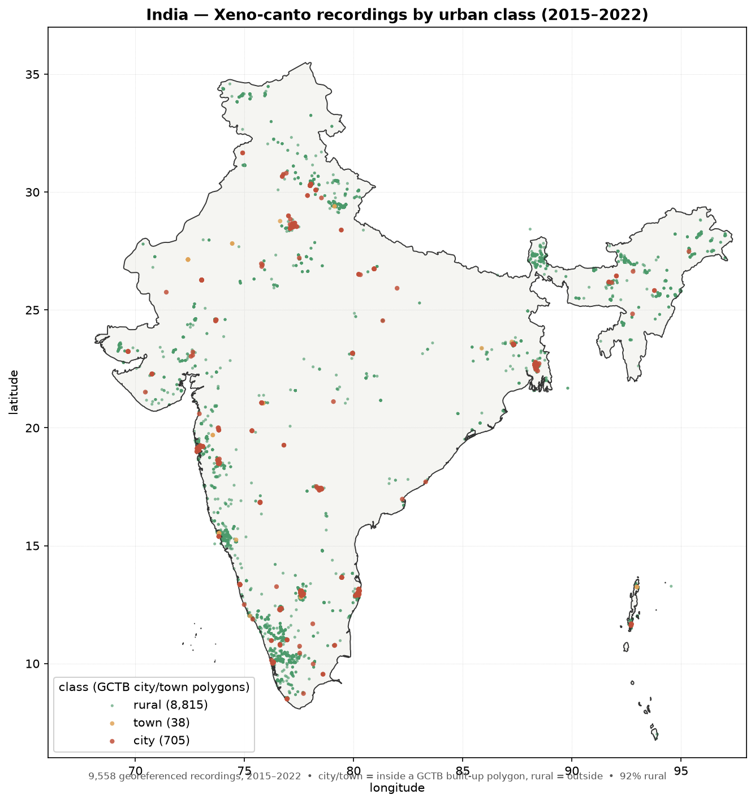

# Acoustic Biodiversity Mapping

A global, location-level biodiversity metric derived from 1,003,444 Xeno-canto wildlife
recordings (1886–2025) and their metadata. See **[report/Acoustic_Biodiversity_Report.pdf](report/Acoustic_Biodiversity_Report.pdf)**
for the full write-up, world map, and results — or read
**[Silent Signal](https://claude.ai/artifact/1odWtHn1mamyeBaiLoJ5eC)** (hosted page), the
same results as one scrollable, interactive page. It opens with a playable year-by-year
time-lapse of the archive (1990–2025) and covers the correlations, the degenerate-row and
merged-index corrections, the biome map, per-biome series, the long-run trend test and the
urban split. Open
**[web/year_explorer.html](web/year_explorer.html)** to scrub/play through the map year by
year (2015–2025).

## The metric

- **Location** = a 0.1° (~11 km) grid cell.
- **Biodiversity value** = `S_rare10` — the expected number of distinct recorded species
  in 10 recordings (Hurlbert sample-based rarefaction; controls for recording effort).
- **Label** = good / moderate / bad, by tertile of `S_rare10` *within the cell's 10° latitude
  band* (region-relative, so a score means "rich for its region").
- **Scope** = cells with ≥ 10 recordings (14,426 of 49,638 cells scored confidently).

## Headline finding

The acoustic indices **do not predict species richness** on this archive: none of the 11
cell-mean index columns tested against it (ACI, ADI, AEI, NDSI, Bioacoustic Index, spectral
and temporal entropy, NB peaks, and the noise-reduced ADI, Bioacoustic Index and spectral
entropy) reaches a Spearman |ρ| above ≈ 0.08, over the 12,678 scored cells that have index
values from this pipeline (which computes 40 metric columns from 16 indices). The indices
were designed for passive soundscape monitoring, but 68% of the archive's clips (median
length 27 s) are single-target recordings.
The defensible biodiversity metric is therefore **effort-controlled species richness from
the metadata**, not any acoustic index. Full limitations are in the report.

## Pipeline (scripts/)

| Script | Purpose |
|--------|---------|
| `download.py` | Download Xeno-canto recordings for one continent (`--continent`, optional `--quality`/`--year`/`--months`) |
| `convert_metadata.py` | Flatten Xeno-canto metadata JSON pages → one CSV (766,747 records) |
| `merge_meta.py` | Left-join metadata onto each `score_<continent>.csv` (base **+ gap + 10-year hist**) by recording `id`, then add the older recordings from `merged_metadata_all.csv`; ids are deduplicated across continents and each row is tagged `index_source` (`local` / `extra`) |
| `build_cells.py` | Aggregate to 0.1° cells, compute rarefied richness, correlate indices vs richness (index means use `index_source == local` rows only) |
| `build_cells_yearly.py` | Same metric split by calendar year (1850–2025 kept; charts use years with ≥ 20 scored cells, 1990–2025) + per-cell change |
| `build_labels.py` | Assign good/moderate/bad tertile labels (global + region-relative) → `grid_cells_labeled*.csv`, `biodiversity_map.csv` |
| `make_report.py` | Render the multi-page PDF report |
| `build_silent_signal_data.py` | Build the JSON data behind the hosted Silent Signal page |

The upstream acoustic-index computation (`compute_indice.py`, `acoustic_index.py`, the SLURM
jobs, and the raw audio/score CSVs) lives in the parent processing project and is **not**
included here — only the analysis layer and its outputs.

## Outputs (outputs/)

| File | Contents |
|------|----------|
| `grid_cells.csv` | Per-cell acoustic features + richness (all 49,638 cells) |
| `grid_cells_labeled.csv` | Global-tertile good/moderate/bad labels |
| `grid_cells_labeled_regional.csv` | Region-relative (latitude-band) labels — **primary** |
| `biodiversity_map.csv` | `lat, lon, continent, n_rec, richness, label, label_code` — ready for GIS/folium (a cell's continent is the one most of its recordings are filed under) |
| `grid_cells_yearly.csv` | Per-(cell, year) richness, 1886–2025 |
| `cell_change.csv` | Cells scored in ≥2 years with first/last richness and trend |

## Merged 1886–2025 archive (2026-09-24)

The 759,767 locally processed recordings (2015–2025) were joined by **245,246 older ones**
from `merged_metadata_all.csv` (1886–2023, scores + metadata in one table; its twin
`merged_metadata_all_1.csv` is an Excel-damaged copy and is not used). After dropping the second copy of
1,569 recordings listed under both Asia and Australia (almost all from Papua New Guinea,
kept under Asia), the archive holds **1,003,444
recordings**. Each merged recording is filed under the continent this pipeline's own
recordings use for the same country and 5° cell (so Siberia goes to Asia and French
Polynesia to Australia, as on Xeno-canto), falling back to the country's majority continent
(with the Dutch Caribbean and French overseas territories placed geographically).

The merged file's acoustic indices come from **different settings**: on the 460,933 clips
both sources scored, its Bioacoustic Index has a median of 324 against our 9.0 (rank
agreement ρ = 0.24). Averaging both scales made Bioacoustic look like a better predictor
(ρ 0.103), purely from which cells hold older recordings. So the merged recordings count
toward species, richness, labels and every yearly series, but **their index values are
excluded** from index means, the ecoregion/urban index summaries and the completeness counts.
Best ρ on this pipeline's own values is 0.081, in line with the 2015–2025 result.

The same refresh fixed a key bug in `build_biome_yearly.py` / `build_urban_yearly.py`:
`cell_change.csv` stores cell centres, and flooring `centre − 0.05` misplaced or dropped 531
of the 3,637 tracked cells (13.45 − 0.05 = 13.3999…). Tracked-cell splits are now keyed with
`round()`.

### Temporal note (1990–2025)

The metric is also computed per year (report page 5). Years before 1990 have at most 17
scored cells each, so the yearly charts cover **1990–2025**. **Even a 36-year window cannot
reveal real biodiversity change** — year-to-year movement reflects *which* cells were recorded
and by *whom* each year (effort + observer turnover), not ecological gain/loss. Treat the
yearly slices as sampling-coverage diagnostics, not a biodiversity time series. 3,637 cells
are trackable across ≥2 years (none across every year), and per-cell change is a near
coin-flip (1,578 up / 1,632 down / 427 flat) — the signature of noise, not a trend.

## Urban classification (city / town / rural)

Each georeferenced recording (2015–2022) is tagged **city / town / rural** by point-in-polygon
against the **GCTB** (Global City & Town Boundaries, 30 m, WGS-84; Liu, Zhang & Bai, Zenodo
`10.5281/zenodo.16418717`, CC-BY-4.0) annual polygons — matched to each recording's *own* year
(`Cities_2018` for a 2018 recording, etc.). GCTB stops at 2022; `city` takes priority over `town`
on overlap; `rural` is the residual (inside neither, i.e. not in a mapped built-up extent).

Globally 512,183 recordings classify as **9.4 % city / 2.5 % town / 88.1 % rural**. India
(figures below) is **~92 % rural** — city recordings cluster in Delhi/NCR, the Mumbai–Pune
corridor, the Western Ghats, Bangalore and Kolkata.

| output | contents |
|---|---|
| `outputs/urban_class_summary.csv` | per-class count (`n_recordings`, `n_indexed`) + mean/median of 12 key indices (all years) |
| `outputs/urban_class_by_year.csv` | per `year × class` count (`n_recordings`, `n_indexed`) + index means/medians (2015–2022) |
| `figures/india_recordings_yearwise.png` | India recordings per year + city/town/rural split |
| `figures/india_recordings_map.png` | India map, recordings coloured by class |



## Ecoregion / biome classification

Every georeferenced recording is tagged with its terrestrial **ecoregion, biome and
biogeographic realm** by point-in-polygon. Unlike the urban layer, ecoregions carry no year
dimension, so **all 976,132 recordings with coordinates** are classified (the urban layer is
capped at 512,183 by GCTB's 2015–2022 coverage).

Two reference layers are applied to the same points:

* **RESOLVE Ecoregions 2017** (Dinerstein et al. 2017, CC-BY-4.0) — 847 polygons, primary.
* **WWF TEOW 2001** (Olson et al. 2001, CC-BY-NC-3.0) — 14,458 polygon parts over 827
  ecoregions; the layer published on Data Basin. Kept for comparison.

The two agree on biome for **96.5 %** of the 971,145 doubly-labelled recordings. RESOLVE
matching is 927,790 exact, 43,695 via a ≤0.1° nearest-polygon fallback (coastal/island GPS
offsets), and 4,647 unassigned (offshore).

Sampling is heavily skewed: **37 % Temperate Broadleaf & Mixed Forests** and **48 % Palearctic**.
Data completeness is *not* uniform across biomes — 94.4 % of this pipeline's georeferenced
recordings carry all 40 index columns, but Mediterranean Forests drops to 84.8 % and the
Palearctic realm to 91.8 %, reflecting where the European processing runs failed. Any biome
comparison inherits that uneven sample. (Index values and completeness counts cover this
pipeline's recordings only; see the merged-archive note above. In `ecoregion_*summary.csv`
and `urban_class_*.csv`, `n_recordings` counts all recordings and `n_indexed` the ones behind
the index means; in the `*_data_counts.csv` tables `n_recordings` counts this pipeline's
recordings only.)

| output | contents |
|---|---|
| `outputs/ecoregion_biome_summary.csv` | per biome: `n_recordings`, `n_indexed` + mean/median of 12 key indices |
| `outputs/ecoregion_realm_summary.csv` | per realm |
| `outputs/ecoregion_summary.csv` | per ecoregion with ≥ 30 of this pipeline's recordings (`n_indexed` ≥ 30; 637 of 847) |
| `outputs/biome_data_counts.csv` | per biome: n + complete-case counts + per-metric valid counts |
| `outputs/realm_data_counts.csv` | same, per realm |
| `outputs/ecoregion_data_counts.csv` | same, per ecoregion |
| `outputs/biome_usable_counts.csv` | per biome usable counts after the degenerate-row guard (from the 2015–2025 run; not regenerated) |
| `outputs/biome_yearly.csv` | per biome x year: cell-years, recordings, median/mean S_rare10 |
| `outputs/biome_change.csv` | per biome: median in the first and last year with ≥ 5 scored cells (any year, so it can start before 1990), their delta, tracked-cell up/down/flat. This is the Δ on the Silent Signal page; report pages 8–9 take the delta over the plotted 1990–2025 years instead (Temperate Broadleaf: −0.3 from 1986, +5.9 from 1992) |
| `outputs/cell_biome.csv` | per grid cell: modal biome + recording count (drives the biome map) |
| `outputs/urban_yearly.csv` | per urban class x year: cells, recordings, median/mean S_rare10 |
| `outputs/urban_change.csv` | per urban class: first vs last median, delta, tracked-cell split |

The per-recording table (`recordings_ecoregion.csv`, 240 MB) is gitignored — regenerate it with
`scripts/classify_ecoregion.py`.

**Caveat.** ACI separates biomes strongly (relative range 96 %), but the ordering is inverted
against expected richness and *within*-biome spread exceeds *between*-biome spread (Iberian
sclerophyllous 5796 vs NE-Spain Mediterranean 1465 — both Mediterranean). That points to
recordist, equipment and target-species effects dominating habitat signal, consistent with the
archive being mostly short focal recordings. Do not read the biome means as habitat acoustics
without controlling for recordist and recording length.

**Year-by-year change by biome** (report page 8) shows **no biome trend that survives
testing**: tested year by year (Kendall τ), 3 of the 14 biome
series reach *p* < 0.05, about the 0.7 expected by chance, and none survives a Bonferroni
correction (smallest *p* = 0.009 against 0.0036). Tracked cells split near 50/50 (1,574 up vs
1,623 down across biomes). The series swing hardest in the years a biome rests on few scored
cells — the signature of small samples, not habitat change.

The report also breaks this out **one biome at a time** (page 9, small multiples with each
biome's recording effort behind it), maps **where each biome's recordings actually are**
(page 11), and repeats the exercise for **city/town/rural** (page 10) — where neither city
(−0.2) nor rural (+0.2) shows a trend over the labelled 2015–2022 window, and tracked cells
split city 123/119 and rural 1,318/1,365 up/down. Outside 2015–2022 each cell keeps the class
its polygons gave it (carried back before 2015 and forward after 2022), since GCTB covers
only those years.

### Is there a long-run trend? (report page 12)

Tested directly, and the answer is **no significant trend, and a well-identified artefact
that could produce the apparent one.** Pooled over everything recorded each year, median
richness falls 10.00 → 9.27 (1990 → 2025), a Theil–Sen slope of **−0.10 species/decade**
(Kendall τ −0.20, *p* = 0.093) — not significant. Holding the cells fixed gives point
estimates of −0.09 to −0.21 per decade for the ≥2/4/6/8-year panels, and every interval
includes zero; the ≥8-year panel (211 cells) is −0.09 [−0.42, +0.28]. The 57 cells scored in
both 2000–2002 and 2023–2025 lean negative (−1.16 species, 23 up / 34 down) but their
interval [−2.61, +0.29] also includes zero.

The mechanism: **44–100% of each year's scored cells are places never scored before**, and
newly scored cells sit below returning ones in **33 of 35** years (sign test across years
*p* ≈ 4×10⁻⁸, on the Silent Signal page). The archive keeps expanding into thinner locations, pulling the pooled median
down while individual places move up and down in roughly equal numbers.

Two caveats, both stated on page 12 (the provenance shares are from the Silent Signal page).
The controlled estimates are **underpowered, not proof of
stability**. And provenance changes with time: geolocated recordings from 1990–2014 all come
from the merged external table, 2015–2022 almost all from the historical backfill, and
2023–2025 86% from the base+gap runs, each downloaded with its own filters. Year and
provenance cannot be separated with what is on disk.

Theil–Sen and Kendall τ-b are hand-rolled in `make_report.py` to avoid a scipy dependency;
both were verified against scipy to machine precision (slope, 95% CI, τ and its tie-corrected
*p*).

## Reproduce

```bash
# Run from the directory that holds score_*.csv and the metadata, with scripts/ linked to this
# repo's scripts (ln -s /path/to/acoustic-biodiversity/scripts scripts). Most steps read and
# write in the working directory; classify_urban.py, classify_ecoregion.py, biome_counts.py and
# plot_india.py instead use absolute paths set at the top of each script (ROOT/PROC = the
# processing directory, GCTB, ECO, NE, PROJ_DATA): point them at your working directory and
# data first. plot_india.py writes to this repo's figures/.

# download recordings (one continent at a time; matches the existing dataset)
python3 scripts/download.py --continent africa     # ... america asia australia europe
python3 scripts/convert_metadata.py <metadata_dir> metadata_2015-2025.csv
python3 scripts/merge_meta.py            # produces score_<continent>_meta.csv (base + gap + hist; expects merged_metadata_all.csv in the working directory)
python3 scripts/build_cells.py           # produces grid_cells.csv + correlations
python3 scripts/build_cells_yearly.py    # produces grid_cells_yearly.csv + cell_change.csv
python3 scripts/build_labels.py          # produces grid_cells_labeled*.csv + biodiversity_map.csv

# urban classification (needs a geopandas env; GCTB polygons at the GCTB path set in classify_urban.py)
python3 scripts/classify_urban.py        # -> recordings_urban_class.csv + urban_class_*.csv
python3 scripts/plot_india.py            # -> figures/india_recordings_*.png

# ecoregion / biome classification (same geopandas env; shapefiles at the ECO path set in classify_ecoregion.py)
python3 scripts/classify_ecoregion.py    # -> recordings_ecoregion.csv + ecoregion_*.csv
python3 scripts/biome_counts.py          # -> biome/realm/ecoregion data-completeness counts
python3 scripts/build_biome_yearly.py    # -> biome_yearly.csv + biome_change.csv + cell_biome.csv
python3 scripts/build_urban_yearly.py    # -> urban_yearly.csv + urban_change.csv

python3 scripts/make_report.py           # produces the PDF (reads the biome/urban tables above)

# data for the hosted Silent Signal page (page template + assembler live in the processing project).
# It also reads the raw score_<c>*.csv files, the per-recording tables and
# merged_metadata_all.csv (inputs are listed in the script's docstring).
python3 scripts/build_silent_signal_data.py silent_signal/data
```
